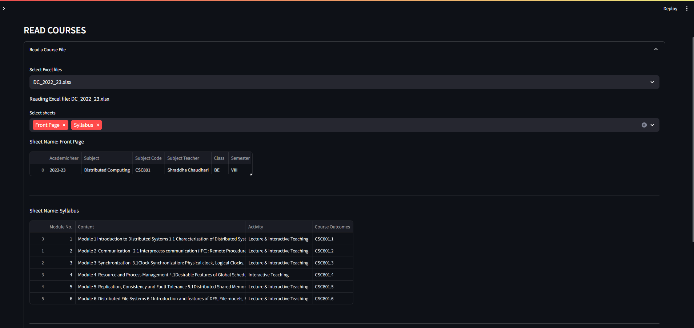
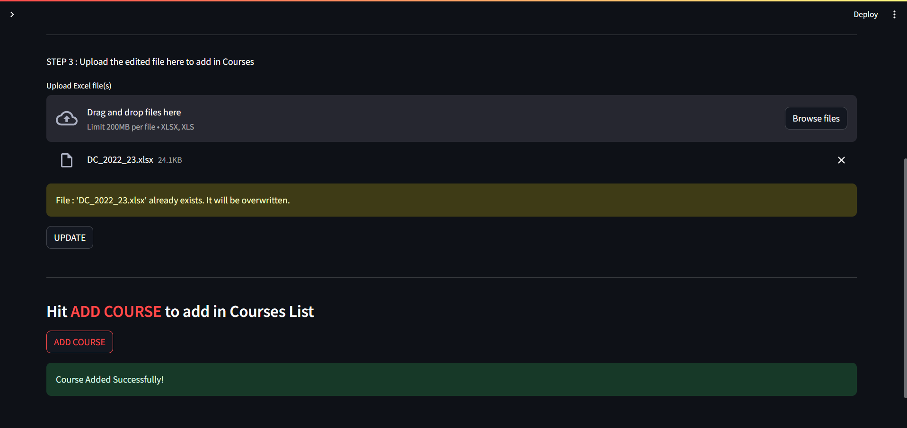
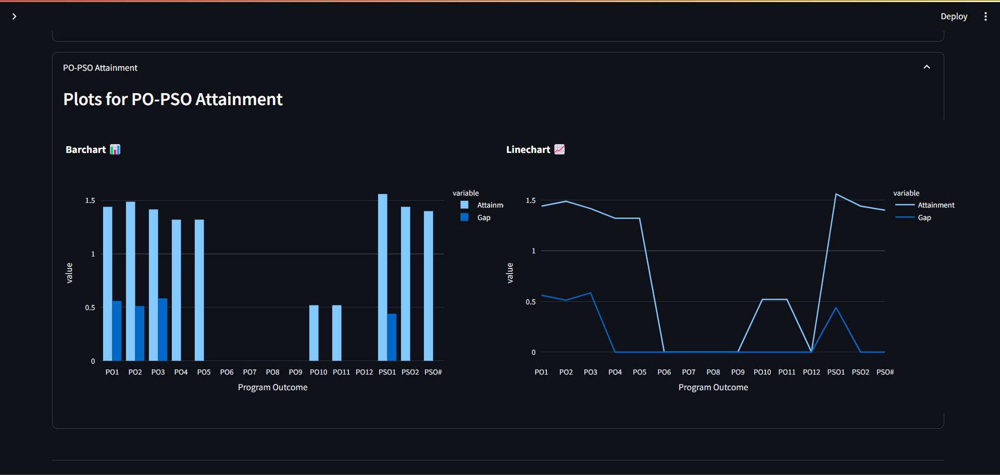

  

## What is Course File App?

Teachers often deal with a vast array of course materials, including course outcomes, syllabus, students marks sheets etc. So, to solve this problem build  streamlined and easy to access platform for organizing these materials systematically in a software.

Course file app aims to provide a centralized platform for organizing course files and their vital data like learning outcomes, students course academical information. It empowers educators & administrators to monitorize and analyze academic progress.

It is designed to assist university professors in managing essential academic tasks efficiently. Built using Python Streamlit for its simplicity and rapid development capabilities, Coursefile offers a range of features tailored to meet the needs of educators.

**This project is currently under development so stay tuned...**

## Features

- Simplified process of **managing CRUD operations** over
   course-related files.     
- Effortless **monitor & navigate** with the system in better UX. 
- It ensures student data to be **Accurate, Secure & Up-to-date.**
- User can inspect different **Data driven insights** for better visualization of grades.

## Getting Started ⬇
  

 1. Run this command in your terminal to get started!
	
     `pip install -r requirements.txt`
	
 2. Start script of the project
	
     `streamlit run 1_📍_Home.py`

 3. Browse the given link
	
      http://localhost:8501/

## Quick views

  

  

  

## Future Scopes 

Implementation of attendance system, team collaberation & virtual activities in between classrooms might be some futuristic scopes of this project idea.

---

